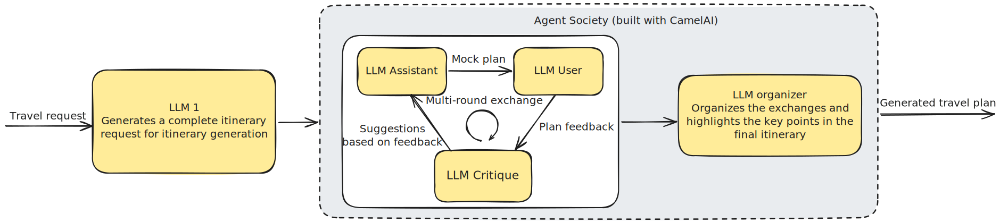
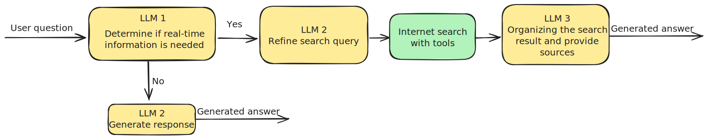

# Trip planner demo

An AI-agent-backed travel-planning web app built with CamelAI, Python, React, TypeScript, and Tailwind CSS.

## Project Overview

Gensee Trip is an interactive travel planning application that helps users create and manage their travel itineraries. The application features an AI-powered chat interface for trip planning and an interactive globe for destination exploration. 

## Agents Involved 

We build a branch gensee_version, demonstrating how easy you could involve GenseeAI into your AI workflow!

You could test the version powered by GenseeAI at [Trip-planner-demo](https://demo.gensee.ai/trip-planner/)

Easy serving and deploy with a few clicks without needing you to modify or annotate your code. The agents build and served on Gensee AI could be seen under the **agents** folder. The attached diagram shows how agents work together and act as a workflow serving your own needs.

- Trip planning Agent: An agent society built with CamelAI.


- QA Agent: A real-time knowledge agent powered by search tools.



### If you find this interesting, feel free to check out [GenseeAI](https://www.gensee.ai/) and the [Serving Platform](https://platform.gensee.ai/)

## Technologies Used

This project is built with:

- **Vite** - Fast build tool and development server
- **TypeScript** - Type-safe JavaScript
- **React** - UI library
- **shadcn-ui** - Modern component library
- **Tailwind CSS** - Utility-first CSS framework
- **React Router** - Client-side routing
- **TanStack Query** - Data fetching and caching
- **Globe.gl** - Interactive 3D globe visualization

## Getting Started

### Prerequisites

- Node.js (version 18 or higher)
- npm or yarn

### Installation

1. Clone the repository:
```bash
git clone <REPOSITORY_URL>
cd trip-planner-demo
```

2. Install dependencies:
```bash
npm install
```

3. Setup your backend that runs the two agents provided in the agents folder

4. Specify the backend URL in the .env file, the .env file should be 
```
VITE_BACKEND_URL=<YOUR BACKEND URL>
```

5. Start the development server:
```bash
npm run dev
```

6. Open your browser and navigate to `http://localhost:8080`

## Available Scripts

- `npm run dev` - Start development server
- `npm run build` - Build for production
- `npm run build:dev` - Build for development
- `npm run lint` - Run ESLint
- `npm run preview` - Preview production build

## Project Structure

```
src/
├── components/     # React components
├── pages/         # Page components
├── services/      # API and service functions
├── hooks/         # Custom React hooks
├── lib/           # Utility functions
└── config/        # Configuration files
```

## Features

- **AI Chat Interface** - Interactive chat for travel planning
- **Interactive Globe** - 3D globe for destination exploration
- **Itinerary Management** - Create and manage travel plans
- **Responsive Design** - Works on desktop and mobile devices
- **Modern UI** - Clean and intuitive user interface

